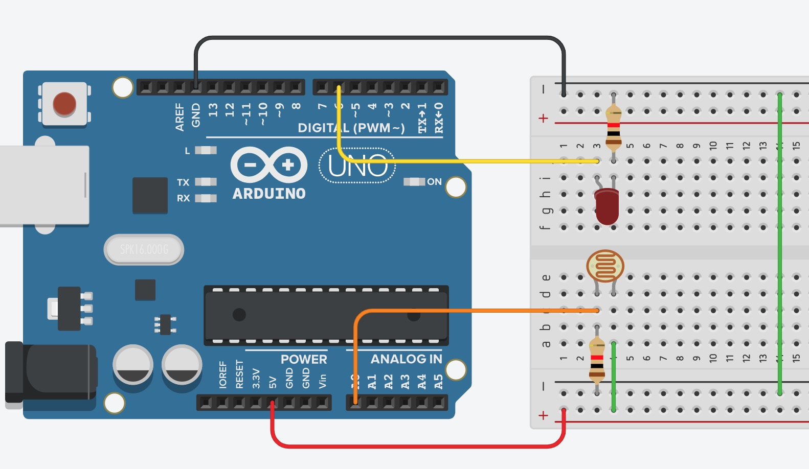

### Blink example

* Set the mode of the pin using the `pinMode(pinNumber, mode)` function. In this case the mode is `OUTPUT`.

<iframe src=https://create.arduino.cc/editor/uaiti/f0b14f3d-f497-447b-b50a-f56bd629e991/preview?embed style="height:510px;width:100%;margin:10px 0" frameborder=0></iframe>


### Input and output examples

<iframe src=https://create.arduino.cc/editor/uaiti/5d844781-b646-42df-b9e9-b192f237ed87/preview?embed style="height:510px;width:100%;margin:10px 0" frameborder=0></iframe>

* The pinMode function is not needed in the **analog** case.
* For input you should use either an internal (e.g., pinMode set to `INPUT_PULLUP`) or external pull-up resistor.

An alternative to pull-up the internal resistor is to use the following code

```pinmode(pin, INPUT);
digitalWirte (pin, HIGH);
```

### Exercise



